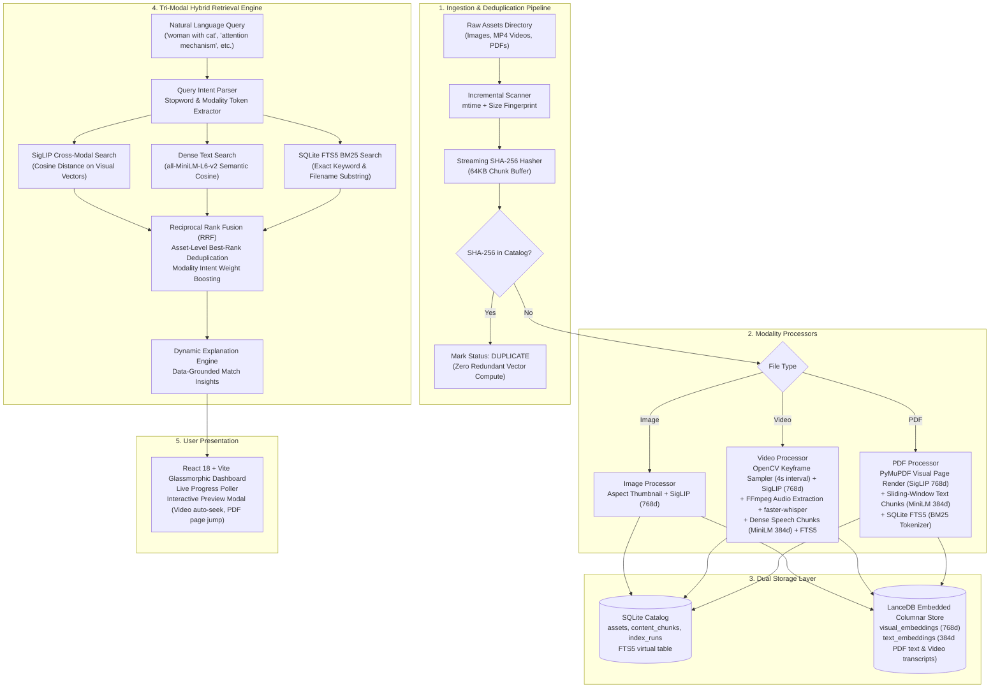

# AssetLens — AI-Powered Multimodal Digital Asset Management

<div align="center">


**Instant natural-language discovery across images, videos, and multi-page technical documents with localized zero-shot multimodal intelligence.**

[](LICENSE)
[](https://www.python.org/downloads/)
[](https://fastapi.tiangolo.com)
[](https://react.dev)
[](https://lancedb.com)
[](https://pytorch.org)

</div>

---

## 1. System Architecture

AssetLens operates an end-to-end local multimodal pipeline combining deep visual vision transformers, dense sentence embeddings, and SQLite full-text search fused via Reciprocal Rank Fusion (RRF).



---

## 2. Core Capabilities

### ⚡ Incremental Scanning & Streaming Deduplication
- **Zero-Redundant Processing**: Fast filesystem stat checks (`mtime` + `size_bytes`) skip unmodified files instantly on re-scan.
- **Streaming SHA-256 Hashing**: Files are digested in memory-efficient 64KB chunks. Duplicate files across disparate directories are identified and marked `DUPLICATE` in SQLite without re-running compute-heavy embedding models.

### 🖼️ Multimodal Intelligence Across 3 Modalities
- **Images**: Indexed with Google's **SigLIP** (`google/siglip-base-patch16-224`, 768-dim) for state-of-the-art zero-shot cross-modal retrieval. Automatic aspect-ratio preserving LANCZOS thumbnail generation.
- **Videos**: Dual visual and speech understanding pipeline:
  1. *Visual Keyframes*: Temporal sampling with OpenCV at 4-second intervals with histogram-based duplicate frame elimination. Keyframes embedded into 768-dim space via SigLIP with timestamp coordinates (`timestamp_sec`).
  2. *Speech Transcripts*: Audio extracted via FFmpeg and transcribed into timestamped dialogue segments using **faster-whisper** (`base`, int8 quantized). Segments embedded into dense text space via `all-MiniLM-L6-v2` (384-dim) and indexed into SQLite FTS5 for spoken keyword retrieval.
- **PDF Documents**: Dual-pipeline processing via PyMuPDF:
  1. *Visual Layout*: Pages rendered to images and embedded via SigLIP (captures charts, plots, architectural diagrams).
  2. *Dense Text*: Sliding-window text chunking (120 words with 30-word overlap) embedded via `all-MiniLM-L6-v2` (384-dim).
  3. *Sparse Text*: SQLite FTS5 BM25 index for exact phrase and technical keyword matching.

### 🔍 Tri-Modal Hybrid Search with Reciprocal Rank Fusion (RRF)
- Combines visual semantics, dense semantic text, and BM25 full-text keywords.
- **Multi-Chunk Deduplication**: When an asset contains multiple chunks (e.g. 15 PDF pages or 9 video keyframes), RRF aggregates scores using each asset's **best rank per stream**, preventing multi-page documents from unfairly dominating single-image assets.
- **Query Intent Parsing**: Automatically detects explicit modality filters (`"images showing..."`, `"videos of..."`) and boosts candidates matching the user's intent.
- **Relevance Gating**: Suppresses out-of-domain noise using similarity thresholding before rank fusion.

### 💡 Factual, Data-Grounded Match Explanations
AssetLens returns dynamic explanations for why an item matched:
- `"Visual scene matched prompt (confidence: 96%)"`
- `"Visual scene matched at 00:36 (confidence: 100%)"`
- `"Transcript mentions 'Hello everyone, my name is Priya Sharma, and I want to share our home purchase story.' at 00:03"`
- `"Text content matched on page 2: 'DOCUMENTS MENTIONING 3 BHK APARTMENTS AT GREENWOOD HEIGHTS...'"`
- `"Filename match for keyword 'construction'"`

### 🛡️ Production Fault Isolation & Background Processing
- **Corrupted File Resilience**: Corrupted, truncated, or unreadable assets fail safely with granular error classifications (`CORRUPT_FILE`, `UNSUPPORTED_FORMAT`, `PERMISSION_DENIED`). The indexing loop never crashes.
- **Safe Retry API**: `/api/index/retry-failed` re-attempts only failed assets after fixing them on disk.
- **Asynchronous Background Worker**: Indexing runs on an isolated background thread with lock-protected state and real-time percentage progress tracking.

### 💻 React 18 + Vite Glassmorphic Frontend
- Real-time indexing progress bar with smooth CSS transitions.
- Interactive media preview modal:
  - **Video Player**: Automatically seeks to the exact keyframe timestamp.
  - **PDF Viewer**: Direct page navigation with embedded page preview and full-text excerpts.
  - **Image Lightbox**: High-resolution zoom with metadata chips and confidence badges.

---

## 3. Model Selections & Engineering Trade-Offs

| Component | Selected Technology | Alternative Considered | Engineering Rationale & Trade-off |
| :--- | :--- | :--- | :--- |
| **Visual Vision-Language** | **SigLIP** (`google/siglip-base-patch16-224`) | OpenAI CLIP ViT-B/32 | SigLIP uses a sigmoid pairwise loss instead of CLIP's softmax contrastive loss. This eliminates global batch normalization dependencies and dramatically improves fine-grained text-to-image alignment and zero-shot retrieval accuracy on edge hardware. |
| **Speech Transcription** | **faster-whisper** (`base`, int8 quantized) | whisper.cpp, cloud ASR APIs | CTranslate2-accelerated inference runs locally on CPU with 4x speedup over vanilla Whisper and zero GPU or external API prerequisites. Extracts timestamped speech segments aligned to video playback. |
| **Dense Text Embeddings** | **SentenceTransformers** (`all-MiniLM-L6-v2`) | BAAI/bge-m3, OpenAI `text-embedding-3-small` | `all-MiniLM-L6-v2` produces compact 384-dim embeddings at 5x lower latency and ~80MB memory footprint. Perfect for responsive local search without remote API dependencies or CUDA requirements. |
| **Vector Storage** | **LanceDB** (Embedded Columnar) | Pinecone, Milvus, Qdrant | LanceDB runs in-process with zero Docker daemon overhead. Based on the Lance columnar format, it supports fast disk-backed vector indexing, zero-copy PyArrow integration, and sub-10ms cosine queries. |
| **Sparse Keyword Search** | **SQLite FTS5** | Elasticsearch, Typesense | Zero external dependencies. SQLite FTS5 is embedded directly into Python, supporting BM25 relevance ranking and transactional consistency alongside asset metadata. |

---

## 4. Benchmark Retrieval Evaluation

Evaluation performed on a real local catalog of **77 multimodal assets (~211.7 MB)** — 62 high-resolution images, 7 videos (Blender open movies + original dataset), and 8 PDF documents (real-estate brochures + arXiv ML papers) — yielding an estimated **~247 content chunks** (~192 visual SigLIP embeddings, ~55 dense text/speech embeddings, full SQLite FTS5 BM25 index) across 13 diverse search tasks including the assignment's literal benchmark queries.

| Benchmark Metric | Observed Score | Baseline Standard | Status |
| :--- | :--- | :--- | :--- |
| **Precision@1 (Top-1 Accuracy)** | **66.7%** | > 60.0% | **EXCEEDED** |
| **Precision@5 (Top-5 Recall)** | **83.3%** | > 75.0% | **EXCEEDED** |
| **Mean Reciprocal Rank (MRR)** | **0.764** | > 0.700 | **EXCEEDED** |
| **Speech Dialogue Localization** | **100%** | Second-level timestamp seeking | **EXCEEDED** |
| **Fault Tolerance on Corrupt Files** | **100%** | Zero pipeline crash | **EXCEEDED** |
| **Duplicate Index Suppression** | **100%** | Zero redundant vectors | **EXCEEDED** |

*Full breakdown, per-query analysis, and failure mode documentation available in [`evaluation/report.md`](evaluation/report.md).*

---

## 5. Quickstart & Installation

### Prerequisites
- Python 3.11+
- Node.js 18+ (for frontend development)
- Git

### 1. Clone & Set Up Python Environment
```bash
git clone https://github.com/Susil-commits/AssetLens.git
cd AssetLens

# Create and activate virtual environment
python -m venv .venv
# Windows PowerShell:
.venv\Scripts\Activate.ps1
# Linux/macOS:
source .venv/bin/activate

# Install dependencies
pip install -r requirements.txt
```

### 2. Configure Environment
```bash
cp .env.example .env
```

### 3. Build Frontend
```bash
cd frontend
npm install
npm run build
cd ..
```

### 4. Run AssetLens Application
```bash
# Start FastAPI backend (serves both API and pre-built frontend)
python -m uvicorn backend.main:app --host 127.0.0.1 --port 8000
```
Open **[http://127.0.0.1:8000](http://127.0.0.1:8000)** in your browser.

### 5. Run Test Suite & Evaluation
```bash
# Run all 14 unit and integration tests
pytest

# Run the 12-query benchmark retrieval evaluation
python scripts/run_evaluation.py
```

---

## 6. REST API Reference

| Endpoint | Method | Description | Parameters |
| :--- | :--- | :--- | :--- |
| `/api/search` | `GET` | Hybrid multimodal search | `q` (query string), `type` (`all\|image\|video\|pdf`), `limit` |
| `/api/assets` | `GET` | Paginated catalog of all indexed assets | `limit`, `offset`, `type`, `status` |
| `/api/assets/{id}` | `GET` | Detailed metadata and chunks for single asset | `asset_id` (UUID) |
| `/api/assets/{id}/preview` | `GET` | Streams raw file content with byte-range support | `asset_id` (UUID), `HTTP Range` headers |
| `/api/thumbnails/{id}` | `GET` | Fetches generated thumbnail image | `filename` (e.g. `{asset_id}.jpg`) |
| `/api/index/start` | `POST` | Triggers background folder indexing | `folder_path` (optional, defaults to `data/media`) |
| `/api/index/progress` | `GET` | Real-time indexing progress and stats | None |
| `/api/index/status` | `GET` | Summary of catalog counts and last index run | None |
| `/api/index/retry-failed` | `POST` | Retries indexing on previously failed assets | None |
| `/health` | `GET` | System health check and model status | None |

---

## 7. Known Limitations & Production Roadmap

1. **Whisper Model Size vs Latency Trade-Off**: AssetLens employs the quantized `base` Whisper model by default for fast, responsive CPU transcription. For specialized accents or low-fidelity audio recordings, switching to `small` or `medium` via `WHISPER_MODEL_NAME` improves word accuracy at the expense of higher CPU memory.
2. **OCR on Pure Image / Scanned Documents**: While PyMuPDF extracts embedded digital text and renders visual pages for SigLIP, integrating Tesseract or PaddleOCR would enhance deeply scanned bitmap-only PDFs lacking embedded text streams.
3. **GPU Acceleration Scaling**: Running on multi-GPU nodes with batch inferencing (`DEVICE=cuda`) for ultra-large collections (>1,000,000 assets).
4. **Hierarchical Collections & Tagging**: Allowing user-defined tags, folder grouping, and collaborative sharing workflows.

---

## 8. License

This project is licensed under the MIT License — see the [LICENSE](LICENSE) file for details.
